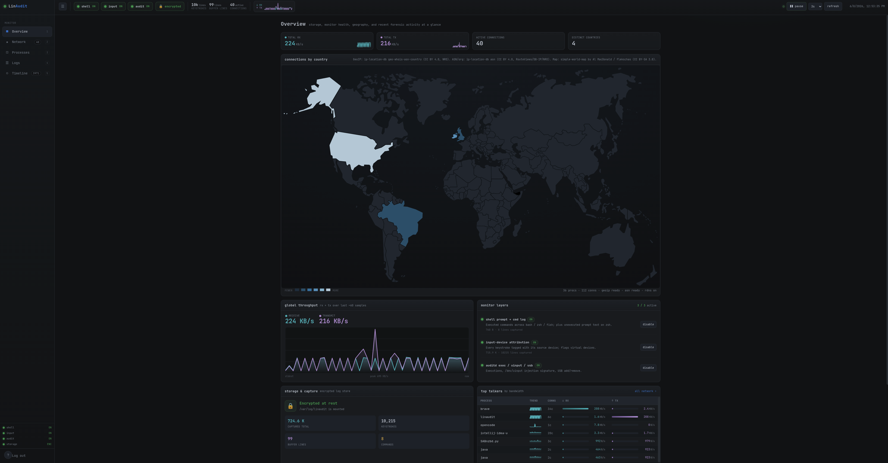

# LinAudit

A local host-monitoring and input-forensics stack for Linux, shipped as one static
Go binary that runs on any popular systemd distro (built and tested on Manjaro/Arch,
GNOME/Wayland, zsh and bash). It was born from a concrete question -- "why do commands I never
typed sometimes appear in my terminal?" -- and grew into a small, self-contained
system that records what happens at the input, shell, and process layers, encrypts
the evidence at rest, and presents it in a password-protected local dashboard.

<p align="center">
  
</p>
<p align="center"><sub>Overview &mdash; monitor health (shell / input / audit), encrypted-store status, live throughput, and the offline GeoIP map of current connections.</sub></p>

> Status: complete and in use -- input/shell/exec monitoring, encrypted storage,
> CLI, web dashboard, and the network panel (listening processes by bandwidth,
> reverse DNS, offline GeoIP country + world map).
>
> Implemented as a single, statically-linked **Go** binary with no interpreter or
> shared-library dependency at runtime; the dashboard markup and world map are
> embedded via `go:embed`. The only non-Go runtime pieces are the shell hooks
> (bash / zsh / fish -- they must run inside the shell). The sole optional external
> tool is `nvidia-smi` (GPU VRAM).

## Highlights

- **Three correlated planes** -- prompt text (even unexecuted), per-keystroke source
  device, and auditd execve / uinput / USB -- so you can tell *typed* from *pasted*
  from *injected* after the fact.
- **Encrypted at rest** -- a LUKS2 log store whose key is sealed to the TPM via
  `systemd-creds`; the writers refuse to start unless it is mounted.
- **Local web dashboard** on `127.0.0.1:8799` -- scrypt login, per-load CSRF token,
  Host allowlist + Origin / Sec-Fetch checks; Overview / Network / Processes / Logs /
  Timeline.
- **Network panel** -- per-process bandwidth read from the kernel over netlink (no
  `ss` / iproute2 dependency), reverse DNS, an offline GeoIP world-map choropleth,
  and offline ASN/owner classification (known corp / cloud / cdn / gov / telecom
  networks vs unknown) so you can see *who* each peer belongs to, not just where.
- **One static Go binary** -- pure standard library, no interpreter or shared
  libraries, assets embedded via `go:embed`; builds for amd64 / arm64 / arm / 386.

## Quick start

```
make build              # -> ./linaudit  (static, no runtime deps)
sudo sh install.sh      # detect user, install, init store, enable services, run doctor
linaudit doctor         # readiness check you can run on any distro
```

Then open <http://127.0.0.1:8799/> -- the first visit sets the dashboard password.

## Why it exists

Most "shell auditing" records only *executed* commands. The original symptom here
was text that appeared in the prompt and was **never executed**, so conventional
history/exec auditing was blind to it. LinAudit instead watches three planes and
correlates them by timestamp, which lets you tell *typed* from *pasted* from
*injected* after the fact.

## The three planes

| Plane | Component | What it captures |
|-------|-----------|------------------|
| Prompt text (even unexecuted, zsh only) + executed commands (bash/zsh/fish) | shell hooks (`shell/linaudit.{zsh,bash,fish}`) | zsh: every line-editor change + every executed command; bash/fish: every executed command |
| Physical / virtual keystroke source | `linaudit-input` service (`inputmon/`) | each key event tagged with its source `/dev/input` device; flags new/virtual (uinput) devices |
| Executions, `/dev/uinput` access, USB add/remove | `auditd` rules + udev rule (`system/`) | `execve`, uinput-injection signature, BadUSB enumeration |

Correlation key: prompt text that grows one character at a time alongside `KEY`
events from a real keyboard was *typed*; text that appears all at once with no
preceding `KEY` was *pasted or injected*; keystrokes from a virtual device or a
`uinput` open are a *software injector*. See `docs/runbook.md`.

The unexecuted-prompt-text plane (per-keystroke buffer growth) requires zsh's
line editor, so it is captured for zsh only. bash and fish capture executed
commands; the same typed-vs-pasted-vs-injected call is still made for them by
correlating each command against the shell-agnostic keystroke plane (a command
that appears with no preceding `KEY` burst was pasted or injected).

## Encryption at rest (LUKS2 + TPM)

All captured logs live in a LUKS2 container (`storage/`), mounted at
`/var/log/linaudit`. The container key is **sealed to the machine's TPM**
(`systemd-creds`, host+tpm2) and released automatically at boot -- the raw key is
never written to disk in plaintext.

- Protects against: a pulled/stolen disk, booting another OS, and backups / btrfs
  snapshots -- all see ciphertext only.
- Does NOT protect against: a live root attacker on the running machine (the key
  is in the kernel keyring while mounted). Use full-disk encryption for that.
- The writers hard-depend on the mount (`Requires=linaudit-store.service`), so if
  the store cannot be unlocked they refuse to start rather than write plaintext.

## Dashboard

- Web UI on `http://127.0.0.1:8799/` (`web/`), bound to loopback only. First visit
  sets a password (scrypt-hashed); login issues an HttpOnly, SameSite=Strict
  session cookie. Per-load CSRF token, Host allowlist (anti DNS-rebind), and
  Origin/Sec-Fetch checks on top.
- Layout: a collapsible sidebar (Overview / Network / Processes / Logs / Timeline) with a
  persistent status rail -- monitor health pills (click to toggle), encryption
  badge, live counts, and the global live/pause + interval control -- visible in
  every section.
- Features: live/pause auto-refresh, global throughput sparklines + per-process
  trends, proportional bandwidth bars, global totals, an alert banner when a
  monitor is off / storage is plaintext, filter/search, sortable tables (including
  by process and a descending-time "age" column), new-connection/-country
  highlighting, scroll + text-selection preservation across refreshes, keyboard
  shortcuts (1-5 sections, / filter, l LAN, w wired, p pause, r refresh), per-tab
  log views (newest first), correlated timeline, offline world-map choropleth,
  enable/disable each layer, logout.
- Noise filters (default ON, toggle-able): the dashboard hides routine local/LAN
  connections and wired-bus (USB/PS-2) keystrokes by default, so the network and
  input views surface only remote peers and non-wired (wireless / virtual /
  injected) input -- the forensically interesting traffic. Each filter has a
  one-click toggle (and an `l` / `w` shortcut) and shows how many rows are hidden.
- Processes view: per-process CPU%, resident memory, and NVIDIA GPU VRAM (via
  nvidia-smi, capturing both graphics and compute procs), plus a system CPU / RAM /
  GPU summary; sortable by any column and filterable.
- CLI panel: `linaudit` (`status | enable | disable | logs | report | live | open | doctor`);
  `web` / `input` / `store up|down|init` are the service entry points of the same binary.
  `linaudit doctor` reports, on any distro, exactly which planes will work here.

## Network panel

The dashboard's network section answers "what is my machine talking to":

- Processes by bandwidth -- every listening or actively-connected process, sorted
  by current rx+tx (delta of the kernel's per-socket `tcp_info` byte counters read
  over netlink, sampled every 2s), with its listening ports.
- Remote connections -- each established peer with reverse-DNS hostname, GeoIP
  country flag, and its owning network. LAN/private/CGNAT/multicast peers are
  classified locally and excluded from rDNS, GeoIP, and the map; they are also
  hidden from the connection list, country bars, and counts by default (a "show
  LAN" toggle and the `l` key bring them back for a full local + remote view).
- Owner networks -- each remote peer is resolved to its ASN and organization via
  an offline ASN database, then bucketed into a colour-coded category: corp
  (Microsoft / Apple / Google / ...), cloud (AWS / Azure / GCP / Hetzner / ...),
  cdn (Cloudflare / Akamai / Fastly / ...), gov (government / military,
  best-effort), telecom (consumer ISPs / carriers), or unknown (no ASN match).
  A legend strip shows the known-vs-unknown breakdown and one-click filters the
  table by category. Government detection is heuristic (AS-name keywords plus a
  small curated ASN list) and intentionally conservative to avoid false positives.
- World map -- an offline choropleth highlighting the countries of current
  connections.

Socket data is read straight from the kernel over netlink (`NETLINK_SOCK_DIAG` /
`INET_DIAG`, including per-socket `tcp_info` byte counters), so there is no
dependency on the `ss`/iproute2 binary. Everything is offline except reverse-DNS,
which uses the system resolver (same as normal browsing) and can be turned off.
GeoIP country and ASN/owner lookups both use bundled local DBs; no observed IP is
ever sent to a third party. (UDP exposes no per-socket byte counters, so UDP shows
as connections without bandwidth.)

## Repository layout / deployment map

The runtime is one statically-linked binary built from the Go packages
(`cmd/linaudit` plus `web`, `web/netmon`, `web/procmon`, `inputmon`, `storage`,
`cli`). The dashboard HTML and world map are compiled into it via `go:embed`.

| Repo path | Deployed to | Notes |
|-----------|-------------|-------|
| `cmd/linaudit` + the Go packages | `/usr/local/bin/linaudit` | one static binary; every role is a subcommand |
| `web/dashboard.html`, `web/world.svg` | embedded in the binary | via `go:embed` -- no sidecar files at runtime |
| `shell/linaudit.zsh` | `~/.config/zsh/linaudit.zsh` | sourced from `~/.zshrc`; captures prompt buffer + executed commands |
| `shell/linaudit.bash` | `~/.config/bash/linaudit.bash` | sourced from `~/.bashrc`; captures executed commands |
| `shell/linaudit.fish` | `~/.config/fish/conf.d/linaudit.fish` | auto-loaded by fish (no rc edit); captures executed commands |
| `inputmon/linaudit-input.service` | `/etc/systemd/system/` | `ExecStart=/usr/local/bin/linaudit input` |
| `web/linaudit-web.service` | `/etc/systemd/system/` | `ExecStart=/usr/local/bin/linaudit web` |
| `storage/linaudit-store.service` | `/etc/systemd/system/` | `ExecStart=/usr/local/bin/linaudit store up`; ordered before the writers |
| `data/fetch-geoip.sh` | downloads to `/usr/local/share/linaudit/geoip/` | offline IP->country + IP->ASN/org DBs (CC BY 4.0) |
| `system/linaudit.rules` | `/etc/audit/rules.d/` | auditd (`augenrules --load`) |
| `system/97-linaudit.rules` | `/etc/udev/rules.d/` | USB/input add-remove -> journal |
| `system/linaudit.logrotate` | `/etc/logrotate.d/linaudit` | daily, 14 days; installer templates the monitored user |
| `system/linaudit-dashboard.json` | `/etc/brave/policies/managed/` | sets the dashboard as Brave homepage |
| `install.sh` | run as root | detect user, build + install everything, store init, enable services, run doctor |
| (generated) `/etc/linaudit/linaudit.env` | written by installer | `LINAUDIT_USER=<user>`; sourced by the store + web units |
| `test/inject/` | `go run ./test/inject` (root) | simulates a software keystroke injector (uinput) |

`linaudit store init` (root, run once) creates the LUKS2 container and seals the key
to the TPM; it replaces the former `secure-init.sh` / `secure-mount.sh` shell
scripts, now folded into the binary (`linaudit store up|down`).

Runtime dependencies: `systemctl` / `journalctl` (the systemd base) and, for the
encrypted store, `cryptsetup` + `systemd-creds` (systemd >= 250). A TPM2 device
hardware-binds the store key; without one the key seals host-only (with a warning).
`auditd`/`auditctl` (exec/uinput/USB plane) and `nvidia-smi` (GPU VRAM) are optional
and degrade gracefully when absent. No Python, no iproute2, no shared libraries. Run
`linaudit doctor` to see exactly what is available on a given host.

Runtime secrets and captured data live OUTSIDE the repo and are git-ignored:
the TPM-sealed key (`/etc/linaudit/store.key.cred`), the password hash
(`/var/lib/linaudit/auth.json`), the encrypted container
(`/var/lib/linaudit/store.img`), and all `*.log` files.

## Build & install

Build (Go >= 1.21; standard library only, so the build is offline and reproducible
and cross-compiles to amd64/arm64/arm/386):

```
make build      # -> ./linaudit  (CGO_ENABLED=0 static, ~7 MB, no runtime deps)
make test       # parity vectors, parsers, classify, scrypt, evdev decode, identity
```

One-step install on any systemd distro (privileged; creates an encrypted volume --
review it first):

```
sudo sh install.sh
```

It auto-detects the monitored user (override with `LINAUDIT_USER=`), installs the
binary + units + configs, templates the logrotate user, fetches the offline GeoIP DB
(`SKIP_GEOIP=1` to skip), runs `linaudit store init` (`SKIP_STORE=1` to skip),
enables the services, installs the shell hooks for every shell present
(bash/zsh/fish), and finishes with `linaudit doctor`.

Prefer to do it by hand: install `./linaudit` to `/usr/local/bin/`; the three units
from `inputmon/`, `web/`, `storage/` to `/etc/systemd/system/`; the configs from
`system/` (substituting `__LINAUDIT_USER__` in the logrotate file); run
`sudo linaudit store init` then `systemctl enable --now linaudit-store
linaudit-input linaudit-web`; `sudo sh data/fetch-geoip.sh`; and install the shell
hooks -- `shell/linaudit.zsh` sourced from `~/.zshrc`, `shell/linaudit.bash` from
`~/.bashrc`, and `shell/linaudit.fish` dropped into `~/.config/fish/conf.d/`
(auto-loaded). If `auditd` is installed, `augenrules --load`.

## Security and privacy notes

- Logs are local and 0600, encrypted at rest, never transmitted.
- The keystroke log is effectively a keylogger (root-only). Disable any time with
  `linaudit disable input`.
- The web service is root and localhost-only; worst case for an authenticated
  abuse is toggling monitoring -- there is no arbitrary-command path.

## Known limitations / TODO

- The monitored user is auto-detected (`LINAUDIT_USER` > `SUDO_USER` > current user
  > store-dir owner > sole login account) and `install.sh` pins it in
  `/etc/linaudit/linaudit.env`; only multi-user hosts with no `LINAUDIT_USER` need
  manual selection. System paths under `/usr/local`, `/var/lib`, `/var/log`,
  `/etc/linaudit` are fixed. The web bind address is overridable via `LINAUDIT_ADDR`.
- Targets systemd Linux (all popular distros: Ubuntu/Debian/Fedora/RHEL/Arch/
  openSUSE/Mint/Pop!_OS). The static binary is distro/libc-agnostic; the units and
  configs assume systemd, and the encrypted store needs systemd >= 250 + cryptsetup.
  a supported shell (bash/zsh/fish) is needed only for the shell plane, and only
  zsh captures unexecuted prompt text; auditd, TPM2, Brave, and nvidia-smi are
  optional and degrade gracefully. `linaudit doctor` reports what is present.
- Builds for amd64/arm64/arm/386 (verified). Tested on amd64; the evdev decode and
  ioctl numbers assume the asm-generic encoding (x86/arm/arm64), so exotic arches
  (mips/ppc/sparc) would need a check.
- No uninstaller yet; `make` covers build/test/install-binary and `install.sh` does
  the full system install.
- Planned/optional: UDP per-process bandwidth (no per-socket UDP byte counters),
  and diff-patch table rendering so refresh does not reset scroll/selection.

## Third-party data and assets

- GeoIP: `ip-location-db` geo-whois-asn-country (CC BY 4.0, by NRO) -- fetched via
  `data/fetch-geoip.sh`, not vendored.
- ASN/org: `ip-location-db` asn (CC BY 4.0, by RouteViews / DB-IP / NRO) -- fetched
  via `data/fetch-geoip.sh`, not vendored.
- World map: `simple-world-map` (`web/world.svg`) by Al MacDonald / Fritz Lekschas,
  CC BY-SA 3.0.

## License

Apache License 2.0 -- see `LICENSE`. Third-party data/assets retain their own
licenses (see above).
